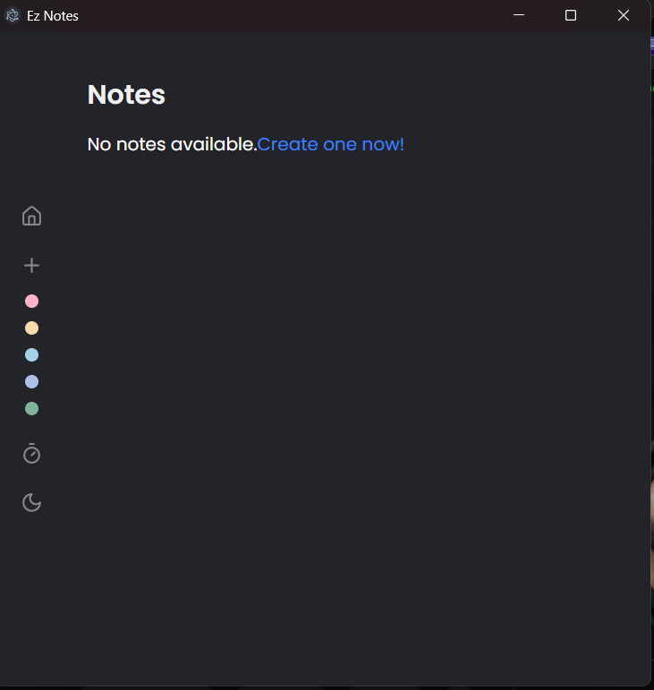
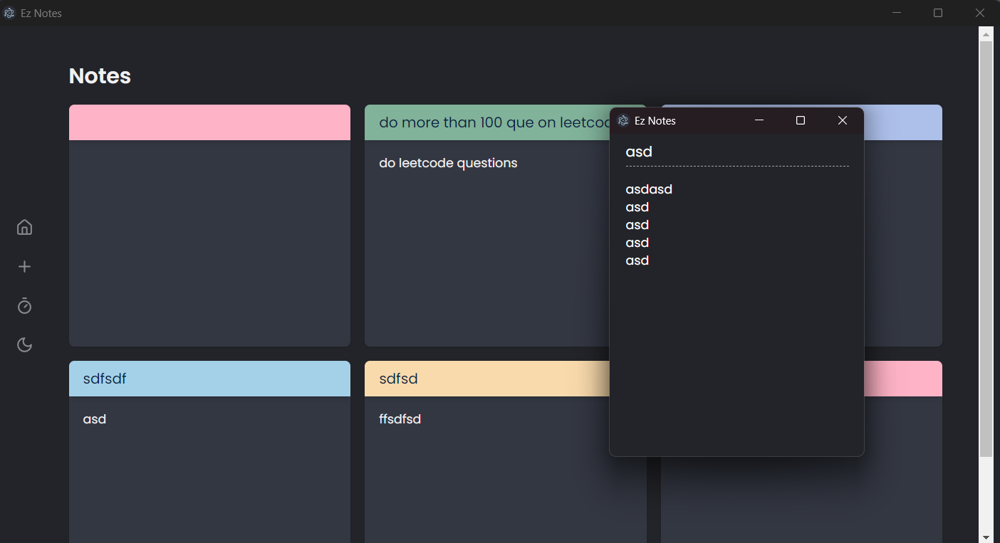
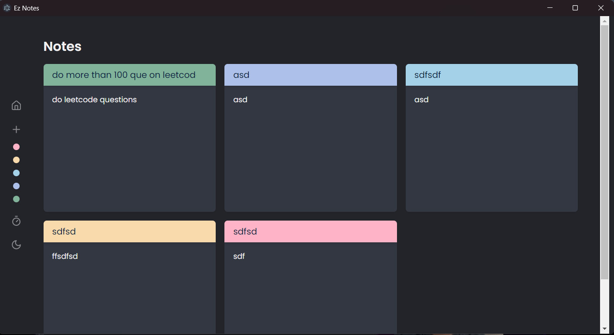
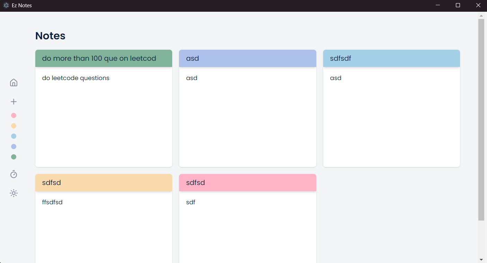
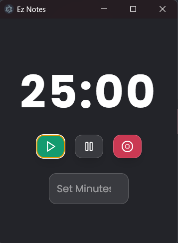

# 🚀 EZ Notes: Simplify Your Productivity

## 📸 Application Screenshots

### 1. Main Dashboard



### 2. Note Pinning Interface



### 3. Dark Mode Experience



### 4. Light Mode Experience



### 5. Time Management Tools



## 🚀 Project Setup Guide

### Prerequisites

- Node.js (v16+)
- npm (v8+)
- Git

### Setup Steps

1. **Fork the Repository**

   - Visit the GitHub repository page
   - Click the "Fork" button in the top right corner
   - This creates a copy of the repository in your GitHub account

2. **Clone Your Forked Repository**

   ```bash
   git clone https://github.com/[YOUR-USERNAME]/ez-notes.git
   cd ez-notes
   ```

3. **Install Dependencies**

   ```bash
   npm install
   ```

4. **Launch Development Server**
   ```bash
   npm run dev
   ```

### Build for Different Platforms

#### Windows

```bash
npm run build:win
```

#### macOS

```bash
npm run build:mac
```

#### Linux

```bash
npm run build:linux
```

## 🌟 Key Features

💾 Firebase Realtime Database Integration

- Real-Time Data Synchronization: Leveraging Firebase Realtime Database for instant, seamless data updates
- Efficient Backend Management: Utilizing Firebase's robust, scalable infrastructure
- Secure Data Storage: Implementing Firebase's built-in security features for reliable note preservation
- Automatic Synchronization: Enabling real-time note updates across different devices and sessions

### 📌 Effortless Note Pinning

- Instant desktop note attachment
- Persistent note storage
- Automatic data synchronization
- Unlimited note preservation

### ⏱️ Smart Time Management

- Precision Stopwatch
  - Millisecond-level tracking
  - Lap recording history
  - Productivity challenge modes
- Complete session logging

### 🗄️ Advanced Database Features

- Offline-first architecture
- Automatic data recovery
- Version history for notes
- Cross-session data retention

### 🌓 Adaptive User Interface

- Seamless dark/light mode switching
- Automatic system theme detection
- Personalized note theming
- High contrast accessibility

### 🔒 Enhanced Security

- End-to-end local encryption
- Secure note storage
- Privacy-first design
- No unnecessary data collection

### 🚀 Performance Optimization

- Minimal system resource usage
- Efficient note rendering
- Low memory consumption
- Quick application startup

### 🌈 Customization Options

- Multiple note color schemes
- Flexible pin settings
- Customizable timer modes
- Personalized interface preferences

## 🤝 Community Guidelines

- Encourage contributions
- Respect original authorship
- Maintain transparency

## 🎯 Core Mission

EZ Notes transforms data complexity into simplicity, ensuring your productivity insights and notes are always preserved, secured, and easily accessible.

### Future Roadmap

- Cloud synchronization
- Multi-device support
- Advanced querying
- Machine learning insights
